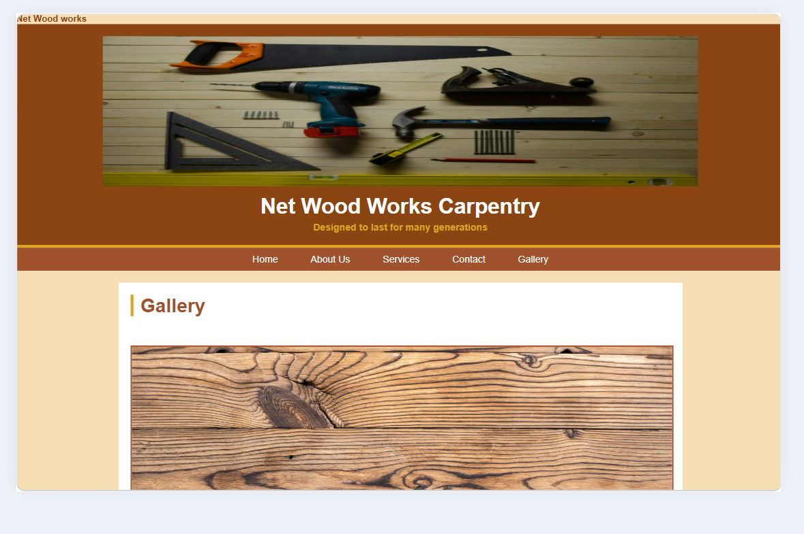
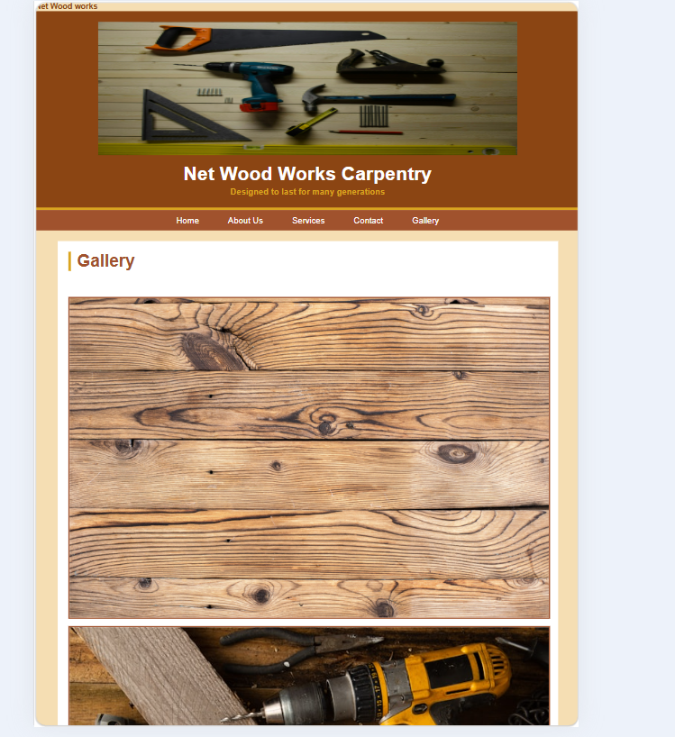
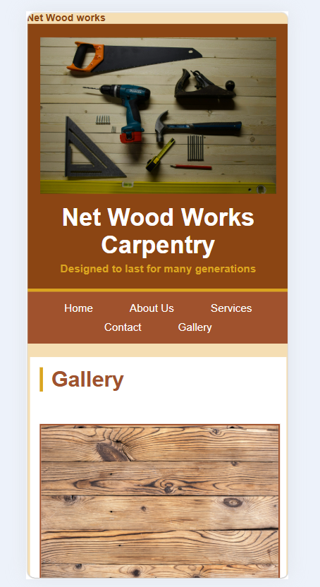

# Net Wood Works Carpentry – Official Website

This is a multi-page static website for **Net Wood Works Carpentry**, a company specializing in custom furniture, kitchen units, wardrobes, shelves, and other wooden installations. The site is built with HTML5, CSS3, and JavaScript, and is deployed on GitHub Pages.

## Part 3 - Enhancements

### New Features Added in Part 3
- **JavaScript Functionality** - Form validation, lightbox gallery, back-to-top button
- **SEO Implementation** - Meta tags, descriptions, keywords, semantic HTML, alt text
- **Interactive Elements** - Lightbox modal for gallery images, smooth scroll animations
- **User Feedback** Error messages and success confirmation on forms

## Features

- **Home** – Welcome message, company intro, and hero section with call-to-action
- **About Us** – Company philosophy, mission, vision, and team information
- **Services** – Detailed list of services with descriptions and example images
- **Gallery** – Visual collection of projects with interactive lightbox functionality
- **Enquiry** – Service enquiry form with JavaScript validation for quotes and custom orders
- **Contact** – Business hours, address, phone, email, and contact form with validation

## Technologies Used
- HTML5
- CSS3 
- JavaScript - External file 
- Visual Studio Code
- Tested in Google Chrome and Microsoft Edge
- Deployed on GitHub Pages

### JavaScript Functionality
- **Form Validation** - Client-side validation for name, email, phone, and message fields
- **Lightbox Gallery** - Click images to view in larger modal with navigation
- **Back-to-Top Button** - Smooth scroll button appears on page scroll
- **Error Handling** - Dynamic error messages display for invalid form inputs

### SEO Implementation
- Meta title and description tags on all pages
- Keyword optimization for carpentry and furniture terms
- Semantic HTML5 elements: `<header>`, `<nav>`, `<main>`, `<footer>`
- Proper heading hierarchy: H1-H3 tags
- Alt text on all images for accessibility
- Mobile-responsive viewport meta tag
- Internal linking between all pages

Net-Wood-Works-Carpentry
├── index.html
├── about.html
├── services.html
├── gallery.html
├── enquiry.html
├── contact.html
├── CSS/
│   └── STYLE.CSS
├── script/
│   └── script.js
├── image/
│   ├── logo.png
│   └── [other images]
└── README.md

## How to Run
1. repository: https://github.com/mukheli21/-net-wood-works-carpentry
2. Open `index.html` in any web browser
3. Live site: https://mukheli21.github.io/-net-wood-works-carpentry/

## Changelog

### Part 3 - 2026-06-18
**Implemented Part 2 Feedback:**
- Fixed navigation links to use lowercase filenames for GitHub Pages compatibility
- Corrected broken image paths from Part 2 feedback
- Updated color contrast on buttons for better accessibility

**New Functionality Added:**
- Added external JavaScript file `script/script.js` with `defer` attribute
- Implemented client-side form validation on enquiry.html and contact.html
- Added lightbox gallery modal for viewing images in larger view
- Created back-to-top button with smooth scroll JavaScript functionality
- Added error handling to display user-friendly messages for invalid form data
- Implemented AJAX form submission to prevent page reload

**SEO Enhancements:**
- Added meta description and keyword tags to all HTML pages
- Implemented semantic HTML5 structure across all pages
- Added descriptive alt text to all images for accessibility and SEO
- Structured proper H1-H3 heading hierarchy on all pages
- Added internal navigation links between all pages
- Implemented mobile-responsive viewport meta tag

**Deployment:**
- Deployed website to GitHub Pages
- Tested all JavaScript functionality on live site
- Verified responsive design on desktop, tablet, and mobile

### Part 2 - 2026-05-29
- Made website responsive using CSS media queries
- Tested layout on desktop, tablet, and mobile viewports
- Added screenshot evidence for responsive testing

### Part 1 - 2026-05-15
- Created 5-page HTML structure: Home, About, Services, Gallery, Contact
- Implemented external CSS stylesheet
- Added navigation bar and basic content

## Test and Iterate - Screenshot Evidence

## Desktop View 

## Tablet View 

## Mobile View 

## References

MDN Web Docs, 2026. *Using media queries*. 
Available at: https://developer.mozilla.org/en-US/docs/Web/CSS/CSS_media_queries/Using_media_queries (Accessed: 28 May 2026).

MDN Web Docs, 2026. *Form validation*. 
Available at: https://developer.mozilla.org/en-US/docs/Learn/Forms/Form_validation (Accessed: 15 June 2026).

MDN Web Docs, 2026. *Document Object Model (DOM)*. 
Available at: https://developer.mozilla.org/en-US/docs/Web/API/Document_Object_Model (Accessed: 15 June 2026).

Net Wood Works Carpentry, 2026. *Company images and content*. 
Available at: https://mukheli21.github.io/-net-wood-works-carpentry/ (Accessed: 28 May 2026).

W3Schools, 2026. *JavaScript HTML DOM*. 
Available at: https://www.w3schools.com/js/js_htmldom.asp (Accessed: 15 June 2026).

W3Schools, 2026. *CSS Media Queries*. 
Available at: https://www.w3schools.com/css/css_rwd_mediaqueries.asp (Accessed: 28 May 2026).

W3Schools, 2026. *CSS Responsive Web Design Tutorial*. 
Available at: https://www.w3schools.com/css/css_rwd_intro.asp (Accessed: 28 May 2026).

W3Schools, 2026. *CSS Tutorial*.
Available at: https://www.w3schools.com/css/ (Accessed: 28 May 2026).

